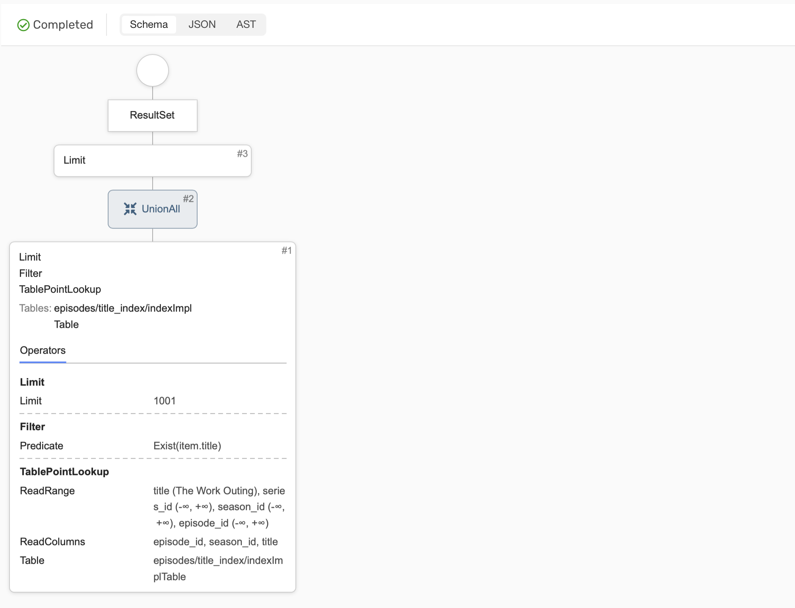

# Query plan optimization

Before executing a query, it is essential to analyze its execution plan to detect and eliminate the reasons for possible excessive cluster resource consumption or abnormally high execution time. This article will discuss specific examples of query plan analysis.

Let's consider the following query that searches for episodes by title:

``` sql
SELECT season_id, episode_id 
  FROM episodes 
  WHERE title = 'The Work Outing'
```

Schema of the `episodes` table:


Let's build a plan for this query, you can do this via UI or {{ ydb-short-name }} CLI:



- {{ ydb-short-name }} CLI

  You can build a query plan via {{ ydb-short-name }} [CLI](../reference/ydb-cli/_includes/index.md) using the following command:
  ```
  ydb -p <profile_name> table query explain \
    -q "SELECT season_id, episode_id 
    FROM episodes 
    WHERE title = 'The Work Outing'"
  ```

  Result:
  ```
  Query Plan:
  ResultSet
  └──Limit (Limit: 1001)
     └──<UnionAll>
        └──Limit (Limit: 1001)
        └──Filter (Predicate: item.title == "The Work Outing")
        └──TableFullScan (ReadRanges: ["series_id (-∞, +∞)","season_id (-∞, +∞)","episode_id (-∞, +∞)"], ReadColumns: ["episode_id","season_id","title"], Table: episodes)
           Tables: ["episodes"]
  ```

- Embedded UI

  You can also build a query plan via [Embedded UI](../reference/embedded-ui/ydb-monitoring.md). You need to navigate to the database page, go to `Query` section and click on `Explain`:

  

  Result:

  



Both plan representations contain the result being returned to the client at the root, table operations at the leaves, and data transformations at the intermediate nodes. It is important to pay attention to the node that contains the table reading operation. In this case, it is a `TableFullScan` for the table `episodes`. Full table scans consume time and resources proportional to the size of the table, so it is advisable to avoid them whenever possible in tables that tend to grow over time or are simply large.

One typical approach to avoid full scans is using a [secondary index](secondary-indexes.md). In this case, it makes sense to add a secondary index for the column `title` using the following query:

``` sql
ALTER TABLE episodes
  ADD INDEX title_index GLOBAL ON (title)
```

Please note that in this example, [synchronous secondary index](../concepts/_includes/secondary_indexes.md#sync) is used. Building an index in {{ ydb-short-name }} is an asynchronous operation, so even if the index creation query is successful, it is advisable to wait for some time, because index may not be ready for use immediately. You can manage asynchronous operations through the [CLI](../reference/ydb-cli/commands/_includes/secondary_index.md#add).

Let's build the query plan using the secondary index `title_index`. It is important that secondary indexes should be explicitly specified in queries using `VIEW` construct.



- {{ ydb-short-name }} CLI

  Command:
  ```
  ydb -p <profile_name> table query explain \
    -q "SELECT season_id, episode_id 
    FROM episodes VIEW title_index
    WHERE title = 'The Work Outing'"
  ```
  
  Result:
  ```
  Query Plan:
  ResultSet
  └──Limit (Limit: 1001)
     └──<UnionAll>
        └──Limit (Limit: 1001)
        └──Filter (Predicate: Exist(item.title))
        └──TablePointLookup (ReadRange: ["title (The Work Outing)","series_id (-∞, +∞)","season_id (-∞, +∞)","episode_id (-∞, +∞)"], ReadLimit: 1001, ReadColumns: ["episode_id","season_id","title"], Table: episodes/title_index/indexImplTable)
           Tables: ["episodes/title_index/indexImplTable"]
  ```
- Embedded UI

  

  Result:

  



The use of a secondary index allowed the query to be executed without fully scanning the main table. Instead of a `TableFullScan`, we received a `TablePointLookup` - reading the index table by key, and we no longer need to read the main table because of all necessary columns are contained in the index table.
